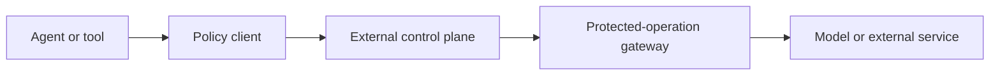
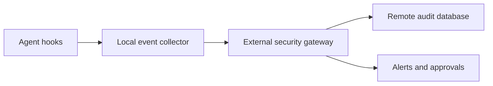

# Agent Runtime Security Controls

**Status:** Working draft v0.3  
**Design target:** Framework-neutral agent runtime  
**Deployment model:** Disposable development container with an external security control plane  
**Policy posture:** Block clear violations; send ambiguous or contextual cases for human review  
**Filesystem model:** One configured workspace root

## 1. Requirement

### 1.1 Purpose

The agent runtime shall prevent model calls and tool calls from causing unauthorised filesystem access, inadvertent disclosure of secrets or personal data, execution of instructions embedded in untrusted content, or destructive and externally consequential actions without appropriate human approval.

The development container shall contain the agent's execution and local development tools. A separate security control plane, outside the agent container's security boundary, shall govern what enters the agent context, which authority the container receives, and what data or effects may leave it.

Controls shall be enforced at the relevant lifecycle and trust boundaries and reinforced by container, operating-system, identity, credential, and network restrictions. Model instructions and prompt-injection detection shall not be treated as substitutes for deterministic authorisation.

The system shall authorise complete effects rather than isolated commands. Policy decisions shall account for the immediate operation, data released, authority exercised, intended audience, and reasonably foreseeable downstream automation or persistent consequences.

### 1.2 Scope

The implementation shall provide framework-neutral policy components that can be connected to equivalent lifecycle events and gateways in a chosen agent framework:

1. **Pre-LLM egress guard** — runs immediately before every model invocation and evaluates the exact context and destination that will receive it.
2. **Model transport gateway** — provides the only permitted network route to model providers and independently verifies that the exact request has a valid policy decision.
3. **Post-LLM observer** — records model-call outcomes and may identify proposed tool calls, but is not the authoritative enforcement point for tool execution.
4. **Pre-tool execution guard** — evaluates a fully resolved tool request immediately before execution and obtains an authoritative allow, block, or review decision.
5. **Post-tool ingress guard** — labels, scans, minimises, and sanitises tool results before they are added to model context or returned elsewhere.
6. **Network egress gateway** — enforces configured service, resource, operation, payload, and destination constraints and pauses unknown or ambiguous requests.
7. **Protected-operation gateway or adapter** — performs or mediates persistent external actions so that the agent cannot bypass policy by using an alternate client or transport.
8. **Operation and credential broker** — performs approved operations where practical and otherwise issues short-lived, narrowly scoped authority without exposing reusable secrets to the model.
9. **Approval broker** — manages human review and binds each approval to one exact proposed effect and relevant state.
10. **Audit sink** — records proposals, decisions, enforcement receipts, and outcomes without recording raw secrets or unnecessary personal data.

These controls shall cover direct tool calls, nested agent calls, delegated calls, retries, handoffs, shell-mediated actions, and calls made through alternate tool adapters. The agent container shall not be able to modify policy, mint its own credentials, approve its own actions, or alter authoritative audit records.

Hooks and framework adapters may collect context, request decisions, and record observations. A hook executing within the agent process or development container shall not be treated as an authoritative security boundary. Protected capabilities shall be available only through an enforcement mechanism outside the agent process, and the container shall have no alternate unmediated route to the same model, network, credential, or external-action capability.

The following security invariants shall hold:

- no model call, protected network request, credential use, or persistent external action can bypass its external enforcement point;
- no protected external action is authorised solely by an in-process hook decision;
- no reusable credential is visible to the model;
- no approval can be reused for a materially different request or state; and
- no execution-plane component can modify authoritative policy, approval state, or audit history.

### 1.3 Architecture and trust boundaries

The system shall distinguish two planes:

- **Execution plane:** the disposable development container containing the agent, shell, repository, build tools, and task-scoped working state. It shall be treated as potentially compromised by untrusted repository or retrieved content.
- **Security control plane:** a host supervisor, service, gateway, locked-down sidecar, or equivalent component outside the agent's security boundary. It shall own policy evaluation, destination and operation approval, protected-operation and credential brokerage, human approval, and authoritative audit state.

The system shall evaluate three trust boundaries:

| Boundary | Examples | Required control |
| --- | --- | --- |
| **Ingress** | User prompts, repository content, files, websites, dependency metadata, tool results, and other-agent output | Attach provenance, classify trust, scan, constrain, and never promote untrusted text into higher-priority instructions. |
| **Authority** | Writable mounts, credentials, network destinations, tools, repositories, branches, APIs, and cloud resources | Grant least privilege for a named task and operation; do not provide ambient or self-service authority. |
| **Egress and effects** | Model context, HTTP requests, uploads, git pushes, pull requests, publishing, deployments, messages, and persistent mutations | Apply data-release and action policy immediately before crossing the boundary; allow, block, or review the exact effect. |

Calls between the execution and control planes shall be authenticated and integrity-protected. If the control plane is unavailable or its response cannot be validated, any operation requiring policy, credentials, or review shall fail closed.

The blocking enforcement path shall follow this pattern, with no permitted direct route from the agent to the protected capability:

The following diagram describes the **audit-event flow**, not the blocking enforcement path. Security events shall flow to authoritative storage through an external gateway rather than through direct database access from the agent:

The local event collector may validate, batch, and temporarily buffer events, but it shall not be authoritative and shall not hold reusable database credentials. The external security gateway shall authenticate the source, enforce event schemas, redact prohibited fields, write to the remote audit database, and initiate alerts or approval workflows. The agent and its execution container shall not receive direct write authority to the audit database.

### 1.4 Decision model

Every guard evaluation shall return one of:

| Decision | Meaning | Required behaviour |
| --- | --- | --- |
| `ALLOW` | The operation satisfies current policy. | Continue and record the decision. |
| `BLOCK` | A clear policy violation or unacceptable risk exists. | Stop before the model or tool call and return a safe, actionable explanation. |
| `REVIEW` | Legitimacy depends on intent, context, or impact. | Pause and obtain a human decision; fail closed if review is unavailable or expires. |

Decisions shall include a stable reason code, human-readable explanation, policy version, relevant redacted evidence, and correlation identifier.

## 2. Container and filesystem controls

### 2.1 Container security baseline

The development container shall be the primary local containment boundary. Its configuration shall, where supported:

- run the agent as a non-root user;
- prohibit privileged mode, host runtime or Docker sockets, host devices, and unnecessary host namespaces;
- drop unnecessary capabilities and prevent acquisition of additional privileges;
- use an immutable or read-only base filesystem with explicit task-scoped writable locations;
- expose only the intended workspace and required build caches, with the narrowest viable access;
- keep control-plane policy, approval keys, credential-broker material, and authoritative audit storage outside agent-writable mounts;
- apply CPU, memory, process, storage, and execution-time limits;
- mediate outbound networking through the configured egress control;
- be disposable or safely reset so task-local persistence does not silently become cross-run authority.

Container isolation reduces blast radius but does not by itself authorise shell actions, protect writable bind mounts, restrict data egress, or prevent misuse of credentials available inside the container.

### 2.2 Workspace root

The runtime shall accept one absolute `workspace_root` through trusted configuration at startup. It shall canonicalise and validate this value before processing agent work. The agent, user content, retrieved files, websites, and tool results shall not be able to change it.

Every filesystem-capable tool shall be subject to the same defence-in-depth path policy, including file readers and writers, patch tools, shell commands, archive extraction, search tools, version-control tools, and tools that accept a working directory or output path. The container and mount configuration remain the primary filesystem boundary.

### 2.3 Path validation

Before execution, the runtime shall:

- reject empty, malformed, device, network-share, or otherwise unsupported paths;
- convert relative paths using the approved workspace root or an already-approved working directory;
- normalise and canonicalise the target without relying on string-prefix comparison;
- verify that the resolved target is the workspace root or one of its descendants;
- reject traversal through `..`, symlink escapes, mount-point escapes, and equivalent aliasing;
- for a new target, resolve and validate its nearest existing parent before creation;
- revalidate paths immediately before use to reduce time-of-check/time-of-use risk;
- use safe filesystem primitives such as no-follow or directory-relative operations where the platform supports them.

The underlying process or container shall also be prevented from accessing host paths outside its authorised mounts. Hooks alone are not a sufficient sandbox, particularly for general-purpose shell commands.

### 2.4 Filesystem decision defaults

- Reads, searches, creation of new files, and bounded, recoverable edits inside the workspace root shall be allowed by default when they do not affect a protected path or trigger another policy rule.
- Any access resolving outside the workspace root shall be blocked and shall not be overridable through ordinary human approval.
- Deletion, recursive changes, irreversible overwrite, permission or ownership changes, version-control history rewriting, destructive database operations, and commands whose impact cannot be bounded shall require review.
- Policy files, approval records, audit configuration, credentials, and version-control metadata may be designated protected paths even when located inside the workspace root.

An edit is recoverable only when the runtime can identify a usable recovery mechanism, such as version control, a snapshot, a recoverable patch, or a retained prior version. The proposed change must also be bounded by a validated target set and configurable size threshold. The existence of a version-control directory alone shall not be treated as proof that uncommitted or ignored content is recoverable. If recoverability or scope cannot be established, the decision shall be `REVIEW`.

## 3. Pre-LLM context controls

### 3.1 Exact payload inspection

The pre-LLM guard shall run before every LLM call, not only the first user turn. It shall inspect the exact serialised context, including system/developer instructions, user and assistant messages, retrieved content, tool results, attachments represented as text, and generated summaries.

Every context item shall carry provenance and trust metadata where available, including source type, source identifier, whether it was user-authored or externally retrieved, and whether it has been transformed or reviewed.

Provenance shall propagate when content is copied, summarised, transformed, cached, extracted from an archive, written into a generated file, passed between agents, or included in a later model call. Transforming untrusted content shall not promote it to trusted instructions. Content derived from mixed-trust inputs shall retain the relevant source relationships. A trust change shall require an explicit validation rule or human decision and shall itself be recorded.

### 3.2 Secret detection

The guard shall use deterministic signatures and entropy-aware or provider-specific detectors where appropriate to identify high-confidence secrets, including:

- private cryptographic keys and seed material;
- access tokens, API keys, session cookies, bearer tokens, and authentication headers;
- passwords and credential-bearing connection strings;
- cloud-provider credentials and service-account material;
- repository, package-registry, database, and webhook credentials.

A high-confidence secret about to be transmitted shall produce `BLOCK`. The response shall identify the category and source location without reproducing the value. The system may offer a separate, explicit sanitisation flow, but shall not silently alter source material and continue unless that behaviour is deliberately configured and tested.

### 3.3 Personal data detection

Personal data policy shall be contextual rather than treating every name or email address as prohibited. Detectors shall distinguish at least:

- **highly sensitive data:** authentication data, financial account data, government identifiers, health information, biometric data, precise location, and data about children;
- **ordinary identifiers:** names, business contact details, usernames, and other data commonly necessary for legitimate work;
- **bulk or linked records:** collections whose sensitivity is materially greater than an individual field.

Only ordinary identifiers intentionally supplied or legitimately present and necessary for the stated task may cross a model or network boundary without review, and then only under data-minimisation rules. Clear transmission of highly sensitive or bulk personal data without a configured legitimate task purpose shall produce `BLOCK`. Legitimate but ambiguous transmission of sensitive or bulk data shall produce `REVIEW`.

The policy shall consider source, destination, purpose, volume, user intent, retention expectations, and whether a less sensitive representation would satisfy the task. Project membership alone shall not make all data within a repository safe to transmit.

## 4. Untrusted instructions and prompt injection

### 4.1 Trust boundary

Content retrieved from websites, files, emails, documents, databases, search results, third-party tools, or other agents shall be treated as untrusted data by default. It shall not be interpolated into system or developer instructions or promoted to a higher-trust instruction channel merely because it resembles an instruction.

External content may be quoted, summarised, or transformed into a validated structured schema. When a workflow genuinely needs to adopt instructions from a file or website, that source shall require an explicit trust rule or human review.

### 4.2 Suspicious pattern detection

Detection should combine deterministic rules with an optional classifier designed for security triage. Signals include:

- attempts to override or ignore prior instructions or authority hierarchy;
- claims that external text is a new system, developer, administrator, or security message;
- requests to reveal prompts, credentials, private context, or hidden data;
- instructions to call tools, execute commands, alter files, or contact external systems unrelated to the user's task;
- attempts to disable guardrails, logging, approvals, or sandbox restrictions;
- encoded, obfuscated, multilingual, or fragmented forms of the same behaviour;
- instructions to persist, relay, or conceal untrusted instructions in later context.

Prompt-injection detection is a risk signal, not proof of malicious intent and not an authorisation mechanism. Quoted examples, security research, documentation, and source code can legitimately contain these patterns.

### 4.3 Handling

- A direct, high-confidence attempt by untrusted content to obtain secrets, escape the workspace, disable controls, or trigger an unauthorised side effect shall produce `BLOCK` for the affected action.
- Suspicious but context-dependent content shall produce `REVIEW` or shall be isolated and processed only through a constrained extraction step.
- External instructions shall never directly authorise a tool call, expand privileges, or change policy.
- Tool-call permissions shall still be evaluated independently even if no prompt injection is detected.

## 5. Network egress, credentials, and external actions

### 5.1 Managed network egress

The default network posture shall be a managed allowlist with review for unknown destinations. Trusted configuration may pre-authorise destinations required for normal development, such as selected package registries, documentation sites, source-control hosts, model endpoints, vulnerability databases, and internal development services.

An egress rule shall be scoped by canonical hostname or service identity, scheme, port, protocol, purpose, calling tool, tenant or account, repository or resource, permitted method or API operation, endpoint or path family, intended recipient or audience, payload type and classification, and maximum payload size where those properties are available. Enforcement shall:

- re-evaluate redirects and block a redirect to an unapproved destination;
- validate DNS results and defend against rebinding or hostname-to-forbidden-address changes;
- block raw IP, link-local, cloud metadata, and private-network destinations unless an explicit trusted rule permits the specific service;
- prevent arbitrary tunnels, user-selected proxies, or alternate transports from bypassing destination policy;
- distinguish loopback development services from host or private-network access;
- enforce application-level operation and resource constraints for multi-purpose services rather than relying only on network-layer destination checks;
- block an approved service from receiving an unapproved data category, resource, operation, audience, or payload volume;
- log destination decisions without recording sensitive payloads.

An unknown destination shall produce `REVIEW`. Approval shall be limited to the proposed hostname/service, scheme, port, purpose, task, and expiry. A one-time approval shall not silently create a permanent allowlist rule; permanent changes require an authorised administrative policy update.

Destination approval does not authorise an arbitrary payload or action. The pre-LLM, data-release, credential, and tool-action policies shall still evaluate what is being sent and what effect is requested.

An allowlisted hostname shall never be treated as a general-purpose upload or exfiltration channel. When the gateway cannot reliably determine the account, resource, operation, audience, or payload classification required by policy, the request shall produce `REVIEW` or `BLOCK` rather than falling back to hostname-only approval.

### 5.2 Brokered operations and short-lived credentials

Where practical, a trusted operation broker or service-specific adapter in the security control plane shall perform the approved operation on behalf of the agent instead of delivering a credential to the execution container. The broker shall accept only schema-valid, policy-approved operations and shall return a correlated enforcement receipt and external outcome.

The execution container shall begin without reusable external-service credentials wherever technically feasible. When operation brokerage is not supported, a credential broker in the security control plane may issue or inject a short-lived credential only after the exact operation satisfies policy or receives required approval.

Each grant shall be scoped to the requesting user and agent, task, service, resource or repository, permitted operation, destination, and short expiry. The grant shall:

- carry no more privilege than the proposed operation requires;
- be single-purpose and non-transferable where the provider supports it;
- be delivered out of band to a trusted adapter or injected at the gateway where possible, rather than placed in prompts, general environment variables, command history, or workspace files;
- never be returned to the model or included in approval text, logs, traces, fixtures, or error messages;
- be revoked or allowed to expire immediately after use;
- be reissued only after reevaluation if the action, resource, destination, or relevant state changes.

Any credential delivered to the execution container shall additionally be isolated from unrelated processes and child processes where supported and shall not be observable through shell history, process listings, diagnostic output, crash reports, or general environment inspection. Use shall be confirmed and the credential shall be revoked or allowed to expire promptly after the authorised operation.

If a provider cannot issue suitably scoped credentials, the action shall require stronger isolation and human review, or shall remain unavailable to the agent.

### 5.3 Persistent external actions

Persistent external actions may proceed without per-action human review only when their direct and reasonably foreseeable downstream effects are bounded, explicitly pre-authorised, and recoverable where recovery is meaningful. Apparent reversibility of the immediate API operation is insufficient.

Before an external action is pre-authorised, policy shall evaluate relevant CI/CD workflows, webhooks, bots, notifications and human audiences, publication or indexing, billing or resource consumption, generated artefacts, downstream deployments, and data disclosed by the action. Unknown or insufficiently constrained downstream effects shall produce `REVIEW`.

Examples that may qualify under an exact pre-authorisation include:

- pushing a non-force commit to a designated agent-owned or task-specific branch only when relevant workflows, bots, webhooks, notifications, and deployment triggers are disabled or separately constrained and authorised;
- creating or updating a draft pull request only for a defined repository, branch, audience, and notification posture; and
- uploading a size-bounded, recoverable, task-scoped development artefact with an approved data classification, recipient, retention expectation, and destination.

The runtime shall require `REVIEW` for force pushes, branch protection changes, merges, releases, package publication, deployments, production access, infrastructure mutation, permission or secret changes, public or person-directed communications, and any action whose target, audience, direct effect, downstream effect, data release, or recovery cannot be confidently bounded.

Pre-authorisation shall identify the service, tenant or account, repository or resource, permitted action types, branch or target pattern, data classification, recipient or audience, downstream automation assumptions, actor, task or session, expiry, retry limit, and recovery mechanism. It shall never be interpreted as general project-wide write authority.

## 6. Disallowed-action policy

“Disallowed content” shall not be implemented as an undefined category of undesirable language. The runtime shall instead maintain an explicit, versioned list of prohibited actions and data flows.

The default prohibited set shall include:

- accessing or modifying resources outside the workspace root;
- acquiring, exposing, or exfiltrating credentials or protected personal data;
- bypassing authentication, authorisation, sandbox, approval, logging, or policy controls;
- executing an action using authority the requesting user or runtime does not possess;
- destructive or irreversible action without the required review;
- hidden persistence, unauthorised privilege escalation, or concealment of agent activity;
- sending data to an unapproved destination or tool;
- obtaining or using credentials outside a brokered, policy-approved grant;
- bypassing the egress gateway through redirects, raw addresses, tunnels, alternate proxies, or covert channels;
- performing a persistent external action outside its exact pre-authorised or human-approved scope;
- changing the security policy through untrusted input.

Discussion, quotation, classification, or defensive analysis of a prohibited action shall not itself be prohibited. Enforcement shall be based on the requested or proposed effect, authority, data flow, and context.

Application-specific content moderation—for example violence, sexual content, harassment, or regulated-domain rules—shall be a separately configured policy module. It should not be conflated with runtime authorisation.

## 7. Tool-call controls and human review

### 7.1 Pre-tool evaluation

The pre-tool guard shall evaluate the tool identity, validated arguments, resolved paths and destinations, calling agent and user, source provenance, requested credential grant, expected local and external side effects, data classification, pre-authorised scope, and prior approvals. It shall run after arguments are fully formed and immediately before execution.

Tools shall use strict input schemas. Unknown fields, type coercion that changes meaning, unresolved variables, and ambiguous targets shall be rejected or sent for review.

For a protected external operation, the pre-tool guard shall be a decision client rather than the final enforcement point. The exact resolved request shall be passed to an external operation gateway or trusted adapter, which shall independently validate the decision and execute the operation. Direct use of an alternate client, raw network transport, shell command, or SDK shall not bypass the same gateway.

### 7.2 Destructive and consequential actions

An ordinary edit to an existing file inside the workspace root shall not require review when it is bounded, recoverable, does not affect a protected path, and satisfies all other policy rules.

The following shall require human review unless a narrower trusted policy explicitly permits them:

- deleting files or directories;
- recursive or bulk mutation above a configured threshold;
- overwriting data without a recoverable version, snapshot, or diff;
- replacing an existing target through move, copy, extraction, or redirection;
- changing permissions, ownership, security policy, credentials, or audit configuration;
- rewriting version-control history or discarding uncommitted work;
- running shell commands whose target or effect cannot be confidently bounded;
- any externally visible, financial, legal, account, merge, release, publication, deployment, infrastructure, or production action designated sensitive by configuration.

### 7.3 Approval properties

An approval request shall show the tool, normalised arguments, resolved target and service identity, anticipated immediate and downstream impact, reason for review, relevant diff or item count, data categories and volume leaving the boundary, intended recipient or audience, authority requested, and whether recovery is available. It shall answer plainly: what will happen, where it will happen, what information will leave, and what downstream activity may be triggered.

Approval shall be:

- bound to a cryptographic digest or equivalent immutable representation of the exact canonical call, resolved destination and service identity, account or resource, data-release manifest, relevant file or repository state, credential scope, expected downstream triggers, and policy version;
- single-use and time-limited;
- bounded by an explicit retry count and idempotency policy;
- invalidated if the tool, arguments, target, destination, data-release manifest, credential scope, policy version, downstream-effect assumptions, or relevant state changes;
- recorded with reviewer identity and decision, but without raw secrets;
- denied by default if the review service is unavailable, times out, or returns an invalid response.

Immediately before execution, the external enforcement point shall recompute and compare the approval binding against the current request and relevant state. Any mismatch shall invalidate the approval and require a new policy decision.

Approval shall not permit access outside the container's authorised mounts, expose unbrokered reusable credentials, create unrestricted network access, or disable mandatory security controls.

### 7.4 Post-tool ingress handling

Before a tool result is returned to the model or another component, the post-tool guard shall:

- attach and propagate provenance and trust metadata, including relationships to transformed or mixed-trust sources;
- scan for secrets and personal data;
- minimise or redact data according to destination policy;
- identify instruction-like content as untrusted;
- enforce size and type limits;
- record the operation outcome using redacted metadata.

## 8. Configuration, reliability, and audit

### 8.1 Policy and control-plane separation

Policy configuration shall be trusted, signed, versioned, schema-validated, and immutable during a run except through an authorised administrative path. At minimum it shall define:

- the absolute workspace root;
- container security profile and authorised mounts;
- protected paths within the workspace;
- destructive-action categories and bulk thresholds;
- permitted tools and destinations;
- managed egress services, accounts, resources, operations, endpoints, protocols, ports, purposes, audiences, payload classifications and sizes, redirect behaviour, and network ranges;
- operation brokers, credential providers, grant scopes, lifetimes, and delivery adapters;
- pre-authorised external actions and their repository, branch, resource, direct and downstream effects, data classification, recovery mechanism, retry limit, and expiry constraints;
- secret detectors and personal-data categories;
- prohibited action and data-flow rules;
- review timeout and approval lifetime;
- failure behaviour for each action and control-service class, including permitted signed-policy caching and audit buffering;
- action classes for which authoritative audit delivery is mandatory before execution;
- audit destination and retention policy.

Policy administration, approval decisions, operation or credential brokerage, and audit administration shall use separate service identities and least-privilege permissions. No routine service identity shall be able to approve an action, execute it, and rewrite its authoritative audit history. High-impact control-plane or policy changes shall require stronger approval, and policy changes shall be independently recorded.

### 8.2 Audit integrity and privacy

Audit records shall contain reliable server-side timestamps, session sequence numbers, correlation identifiers, authenticated actor, agent, collector and gateway identities, lifecycle boundary, event type, decision, reason code, policy version, redacted target and destination metadata, credential-grant reference, approval reference, enforcement receipt, retry or idempotency identifier, and observed outcome. Raw credentials, secrets, full personal records, raw prompts, full payloads, and unnecessary content shall not be logged by default.

The system shall correlate at least four distinct event classes where applicable: the agent's proposed intent, the control plane's policy decision, the enforcement gateway's execution receipt, and the external service's confirmed or observed outcome. Partial success, retries, timeouts, or conflicting outcomes shall be reconciled or surfaced as unresolved rather than represented as an unqualified success.

The authoritative audit sink shall be outside the execution container's writable boundary. The remote audit store shall support append-only or equivalently tamper-resistant records, encryption in transit and at rest, restricted administrative access, explicit retention and deletion policies, and detection of deletion, duplication, or reordering through sequence validation, tamper-evident chaining, or independently stored checkpoints. Access to security audit records shall itself be audited. Operational diagnostic logs and security audit records shall use separate access and retention controls where their purposes differ.

The container's managed egress policy shall permit authenticated event delivery only to the approved logging gateway, not directly to the database. The gateway shall authenticate workload identity, apply reliable timestamps, enforce event schemas, reject prohibited fields, and monitor collector heartbeats and sequence gaps. The agent's own event stream shall be treated as evidence of intent, not proof that an action occurred or did not occur.

### 8.3 Failure handling

The runtime shall expose a clear degraded-security state and apply the following default failure behaviour. Trusted configuration may be stricter but shall not grant additional external authority during a control-plane outage.

| Failure | Routine local work | Data release or credential use | Persistent external action |
| --- | --- | --- | --- |
| Audit database or gateway unavailable | Buffer permitted events within strict encrypted size and time limits. | `BLOCK` | `BLOCK` |
| Approval service unavailable | Continue only when no approval is required under a valid policy decision. | `BLOCK` when approval is required. | `BLOCK` when approval is required. |
| Policy service unavailable | Use an unexpired signed cached policy only for explicitly permitted local operations. | `BLOCK` | `BLOCK` |
| Local audit buffer full, corrupted, expired, or unverifiable | Stop operations requiring new audit events and report the degraded state. | `BLOCK` | `BLOCK` |
| Heartbeat or audit sequence gap detected | Alert and restrict activity according to policy. | Suspend new grants. | Suspend new external writes. |

Any local audit buffer shall be encrypted, integrity-protected, size-bounded, time-bounded, non-authoritative, and flushed in order when service is restored. Actions designated mandatory-audit shall fail closed until an authoritative pre-execution record is accepted.

## 9. Acceptance criteria

The implementation is acceptable when automated tests demonstrate that:

1. The execution container cannot alter control-plane policy, credential brokerage, approvals, or authoritative audit records.
2. The container profile rejects privileged mode, host runtime sockets, unapproved host mounts, and privilege-expanding configuration.
3. A normal read or bounded, demonstrably recoverable edit inside the workspace root is allowed without review.
4. Absolute paths outside the workspace, `../` traversal, and symlink escapes are blocked.
5. A new target whose parent escapes through a symlink is blocked.
6. The same directory rules apply through file, patch, shell, archive, and version-control tool adapters.
7. Access to an allowlisted development service is allowed only for the configured account, resource, operation, endpoint, payload classification and size, audience, and purpose.
8. An unknown destination produces `REVIEW`, while link-local metadata endpoints and unapproved private-network or raw-IP destinations are blocked.
9. Redirects, DNS rebinding, alternate proxies, and tunnels cannot bypass destination policy.
10. An approved destination does not allow a disallowed payload or unauthorised external action.
11. The container starts without reusable external-service credentials; a trusted broker performs the approved operation where supported, and any fallback credential grant is scoped to the exact task, service, resource, operation, destination, and expiry.
12. A credential grant cannot be reused for a different resource, operation, destination, or materially changed call and is never exposed to the model or logs.
13. A non-force push to a designated task branch or creation of its draft pull request may proceed under a valid pre-authorisation only when the relevant workflows, webhooks, bots, notifications, audience, data release, and deployment triggers are disabled or separately constrained and authorised.
14. Force push, merge, release, publication, deployment, infrastructure mutation, permission change, and production access produce `REVIEW`.
15. A high-confidence private key or access token in outbound LLM or network content blocks transmission without logging the value.
16. Necessary ordinary identifiers can be transmitted under data-minimisation rules, while ambiguous sensitive or bulk personal data is sent for review and clearly unauthorised transmission is blocked.
17. Instructions embedded in a retrieved page or file remain labelled as untrusted and cannot authorise a tool call.
18. A direct injection attempting to reveal credentials, expand authority, bypass egress, or escape the workspace is blocked at the relevant action boundary.
19. A quoted prompt-injection example used for defensive analysis is not automatically treated as malicious; ambiguity is reviewable.
20. Destructive or consequential calls pause before execution and display what will happen, where it will happen, what information will leave, what downstream activity may be triggered, the authority requested, and available recovery options.
21. Approval for one call cannot be reused after any material argument, target, destination, data-release manifest, credential scope, downstream-effect assumption, policy, or relevant state change.
22. A review timeout, invalid control-plane response, or mandatory guard failure fails closed.
23. Tool results containing secrets or embedded instructions are sanitised or withheld before entering later model context.
24. Nested, delegated, retried, handed-off, and shell-mediated calls cannot bypass the guards or gateways.
25. Audit events contain decision evidence and grant references but no raw credential, detected secret, raw prompt, full payload, or unnecessary personal data.
26. The agent can submit schema-valid audit events only through the approved gateway and has no direct database credential or authority to alter stored audit history.
27. A logging outage produces a visible degraded-audit state; mandatory-audit actions fail closed, while any permitted buffering remains encrypted, bounded, and recoverable.
28. A direct model call, raw API client, alternate SDK, shell command, or network path that bypasses registered hooks is denied by the external enforcement layer.
29. An allowed hostname cannot be used with an unapproved tenant, resource, method, API operation, endpoint, audience, payload classification, or payload volume.
30. When an operation broker supports an approved action, the agent receives an execution result and correlated receipt without receiving the service credential.
31. Changing an approved file, repository state, destination, audience, data-release manifest, downstream trigger, or retry condition invalidates the approval before execution.
32. A nominally reversible action that activates an unapproved workflow, webhook, bot, notification, publication, billing event, or deployment produces `REVIEW` or `BLOCK`.
33. Untrusted provenance is retained through summarisation, transformation, caching, generated files, archive extraction, and transfer between agents.
34. Missing, duplicated, or reordered audit events and failed collector heartbeats are detected and cause the configured restriction or alert.
35. Access to security audit records is itself audited, and operational logs do not provide a less-controlled copy of raw prompts, secrets, or unnecessary personal data.
36. Control-plane outages follow the documented failure matrix: signed-policy caching and audit buffering cannot grant new external authority.
37. Proposed intent, policy decision, gateway receipt, retry or partial-success state, and externally observed outcome can be correlated and unresolved discrepancies are surfaced.

## 10. Non-goals

This control layer does not claim to:

- detect every prompt injection or personal-data instance;
- determine user intent with certainty;
- replace operating-system sandboxing, identity controls, or least-privilege credentials;
- provide a universal content-moderation taxonomy;
- make an unsafe general-purpose shell safe solely by parsing command text;
- make an allowlisted destination trustworthy for every payload or action;
- guarantee that container isolation alone prevents host or external-system impact;
- predict every downstream effect of an external service or repository automation;
- make human approval proof that an action is safe or correct; or
- eliminate the need to secure, monitor, and independently administer the control plane and audit infrastructure.

## 11. Implementation prompt

Use the following prompt with a coding agent after providing access to the target repository:

> Implement the “Agent Runtime Security Controls” requirement contained in this document.
>
> Begin by inspecting the repository and identifying the agent framework, development-container configuration, model-call lifecycle, model transport, every tool and shell execution path, network path, operation or credential broker, source-control integration, configuration system, existing approval mechanism, audit path, and test conventions. Do not assume framework-specific hook names. Map the required pre-LLM, model-gateway, post-LLM, pre-tool, post-tool, network, protected-operation, credential, approval, and audit boundaries to the framework and deployment actually present.
>
> First produce a concise implementation plan, threat-boundary map, and coverage manifest for ingress, authority, and egress/effects. Explicitly list every model-call, tool-call, network, credential, and external-operation path that must be covered, including nested agents, handoffs, retries, shell execution, file operations, archives, package scripts, network clients, version-control operations, external APIs, and alternate adapters. Identify every bypass path that cannot be reliably guarded in-process and replace it with external containment or gateway enforcement, or keep the capability unavailable.
>
> Separate the execution plane from the security control plane. Treat the development container as disposable and potentially influenced by untrusted content. Keep authoritative policy evaluation, approval state, protected-operation execution, credential brokerage, and audit integrity outside the agent container's writable security boundary. Treat hooks and framework adapters as policy clients and observers, not authoritative security boundaries. The agent must not be able to alter policy, approve itself, mint credentials, rewrite authoritative audit events, or reach a protected model or external capability through an unmediated route.
>
> Implement a framework-neutral policy core and authenticated control-plane interface with thin framework adapters. Use an explicit `ALLOW`, `BLOCK`, and `REVIEW` decision model with stable reason codes, redacted evidence, policy version, and correlation IDs. Centralise policy evaluation so individual tools cannot accidentally implement inconsistent rules. Authorise the complete effect, including immediate action, released data, authority, audience, relevant state, recovery, and reasonably foreseeable downstream automation. Fail closed when a required control-plane decision is unavailable or invalid.
>
> Harden the development container as the primary local containment boundary: use a non-root identity, prohibit privileged mode and host runtime sockets, minimise capabilities and host mounts, isolate writable paths, enforce resource limits, and prevent the agent from modifying control-plane material. Configure one trusted absolute workspace root at startup. Apply defence-in-depth canonical path validation to every filesystem-capable tool, including working directories and indirect output paths. Defend against traversal, symlink escape, new-file parent escape, archive extraction escape, and time-of-check/time-of-use issues. Do not rely on string-prefix checks or prompt instructions.
>
> Implement managed network egress. Allow only trusted, purpose-scoped development services by default; send unknown destinations for review. Bind rules and temporary approvals to canonical service or hostname, scheme, port, protocol, tenant or account, repository or resource, method or API operation, endpoint family, audience, payload type, data classification, size, purpose, task, and expiry. Re-evaluate redirects and DNS results; block unapproved raw IP, link-local metadata, private-network, proxy, and tunnel bypasses. Enforce application-level restrictions for multi-purpose services. Treat destination approval and payload, resource, audience, and action approval as separate decisions; never turn an allowlisted hostname into a general upload channel.
>
> Implement operation brokerage and brokered short-lived credentials outside the execution container. Prefer a trusted service-specific adapter that performs the exact approved operation and returns a correlated receipt without exposing the credential. Start without reusable service credentials. Use credential delivery only as a fallback when operation brokerage is unavailable, and bind each grant to the user and agent, task, service, repository or resource, operation, destination, and short expiry. Keep delivered credentials isolated from unrelated processes, child processes, shell history, process listings, diagnostics, crashes, model context, workspace files, logs, approval text, traces, fixtures, and errors. Reevaluate and reissue authority when the proposed call changes.
>
> Add a pre-LLM egress guard that inspects the exact context and destination on every model call, backed by a model transport gateway that is the only permitted route to the provider and independently validates the exact request decision. Preserve provenance for user content, system/developer instructions, retrieved files and pages, tool results, summaries, transformed content, generated files, caches, archives, and other-agent output. Detect high-confidence secrets and contextual personal-data risks without logging sensitive values. Allow only necessary ordinary identifiers without review and minimise them. Block clear secret or unauthorised sensitive-data disclosure; route ambiguous sensitive or bulk personal data to review.
>
> Treat content retrieved from files, websites, tools, databases, emails, and other agents as untrusted data by default. Never promote it into a higher-priority instruction channel. Propagate source relationships and trust metadata through summarisation, copying, transformation, caching, archive extraction, generated files, and transfer between agents. Add layered prompt-injection triage using deterministic patterns and, if already supported, an isolated classifier. Detection must remain a risk signal: deterministic permission and data-flow controls at the external action boundary are authoritative.
>
> Define disallowed behaviour as explicit prohibited actions and data flows, not as a vague harmful-content category. Keep application content moderation as an optional separate policy module. Ensure legitimate quotation, analysis, and defensive testing do not automatically trigger a hard block.
>
> Add a mandatory pre-tool guard and a post-tool ingress guard. For protected external actions, use an external operation gateway or trusted adapter as the final enforcement and execution point. Require human review for destructive, irreversible, externally consequential, or insufficiently bounded actions. Bind approval to the exact canonical tool call, service identity, account or resource, destination, audience, data-release manifest, relevant file or repository state, credential scope, downstream-effect assumptions, retry policy, and policy version; make it single-use and expiring. Recompute the binding immediately before execution. Never allow approval to override the mount boundary, operation or credential broker, egress gateway, or other mandatory controls.
>
> Allow ordinary edits to existing files inside the workspace without approval only when their target set and size are bounded, an actual recovery mechanism is available, protected paths are unaffected, and all other policy checks pass. Do not assume that the mere presence of version-control metadata makes uncommitted or ignored content recoverable.
>
> Permit persistent external actions without per-action review only when their direct and reasonably foreseeable downstream effects are bounded, explicitly pre-authorised, and recoverable where meaningful. Do not treat apparent API-level reversibility as sufficient. Evaluate CI/CD workflows, webhooks, bots, notifications and audiences, publication or indexing, billing or resource consumption, generated artefacts, downstream deployments, and released data. Permit a task-branch push or draft pull request automatically only when those downstream effects are disabled or separately constrained and authorised. Require review for force pushes, merges, releases, publishing, deployments, infrastructure changes, permission or secret changes, public or person-directed communications, production access, and any effect whose target, audience, downstream behaviour, or recovery is uncertain.
>
> Add structured, redacted audit events to an authoritative sink outside the execution container. Correlate proposed intent, policy decision, enforcement receipt, retries or partial success, and the externally observed outcome. Authenticate workload identities; use server-side timestamps, sequence validation, heartbeats, and tamper-evident chaining or independent checkpoints; detect missing, duplicated, or reordered events; audit access to security records; and separate operational-log access and retention where appropriate. Never write raw credentials, secrets, raw prompts, full payloads, or unnecessary personal data to logs, exceptions, traces, fixtures, snapshots, or approval messages. Implement the documented outage matrix so signed-policy caching and audit buffering never create new external authority.
>
> Implement tests for every acceptance criterion in this document, including bypass attempts across alternate adapters and nested execution paths. Include adversarial cases for direct model or API calls, raw transports, alternate SDKs, encoded or quoted injection text, lost provenance, symlink and archive escapes, redirects and DNS rebinding, metadata endpoints, proxy or tunnel bypass, allowlisted-service payload abuse, changed data or state after approval, unapproved CI or webhook triggers, credential reuse, missing or reordered audit events, partial external outcomes, detector and control-plane failure, review timeout, and sensitive leakage through logs, egress, or tool results.
>
> Minimise unrelated changes and preserve existing behaviour for allowed operations. Do not add a dependency without explaining why existing facilities are insufficient. Do not claim completion until the full relevant test suite passes and you have reported residual risks, framework limitations, and any controls that still require deployment-level enforcement.

## 12. Design rationale and references

This design deliberately puts enforcement beside side effects rather than relying only on agent-level input or output checks. Official OpenAI documentation distinguishes input/output guardrails from tool guardrails and recommends human review before sensitive side effects: <https://developers.openai.com/api/docs/guides/agents/guardrails-approvals>.

It also treats retrieved text as untrusted data, constrains data flow, keeps approvals enabled for tool use, and combines prompt-injection detection with isolation and validation, consistent with OpenAI's agent safety guidance: <https://developers.openai.com/api/docs/guides/agent-builder-safety>.

The container is treated as containment rather than complete authorisation. Docker documents that bind mounts are writable by default and allow container processes to modify host-mounted files: <https://docs.docker.com/engine/storage/bind-mounts/>. Docker also warns that control of daemon credentials can provide root-level authority over the daemon host: <https://docs.docker.com/engine/security/protect-access/>.

The broader separation of container isolation, access control, configuration, audit, and communications protection is consistent with NIST's Application Container Security Guide: <https://csrc.nist.gov/pubs/sp/800/190/final>.
